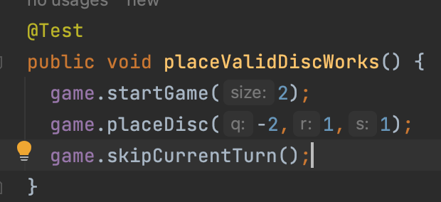

Board coordinate design is based on https://www.redblobgames.com/grids/hexagons/

    Overview: 
This code is designed to allow the user to play a game of Reversi by interacting with the
controller, which interacts with the model and view.
Some high level assumptions that can be 
made are that the project is designed on a MVC standard and that the view cannot directly 
change the model. Also, that only the controller is allowed
to affect things in the model. Prerequisites for using this code would be understanding all
of the player move options in the Reversi game.

What problem is this codebase trying to solve? What high-level assumptions are made 
in the codebase, either about the background knowledge needed, about what forms of extensibility 
are envisioned or are out of scope, or about prerequisites for using this code?

    Quick start: 

A user may interact with MutableReversi through methods placeDisc() and skipTurn().
A user may interact with ReadOnlyReverseModel through methods like getColorAt(), isGameOver,
startGame(), etc.

    Key components: 
Explain the highest-level components in your system, and what 
they do. It is trite and useless to merely say “The model represents the data in my system. 
The view represents the rendering of my system. ...” This is a waste of your time and the reader’s time. 
Describe which components “drive” the control-flow of your system, and which ones “are driven”.

        Key subcomponents: 
Within each component, give an overview of the main nouns in your system, 
and why they exist and what they are used for.

    Source organization: 
Either explain for each component where to find it in your codebase,
or explain for each directory in your codebase what components it provides. Either way, supply 
the reader with a “map” to your codebase, so they can navigate around.