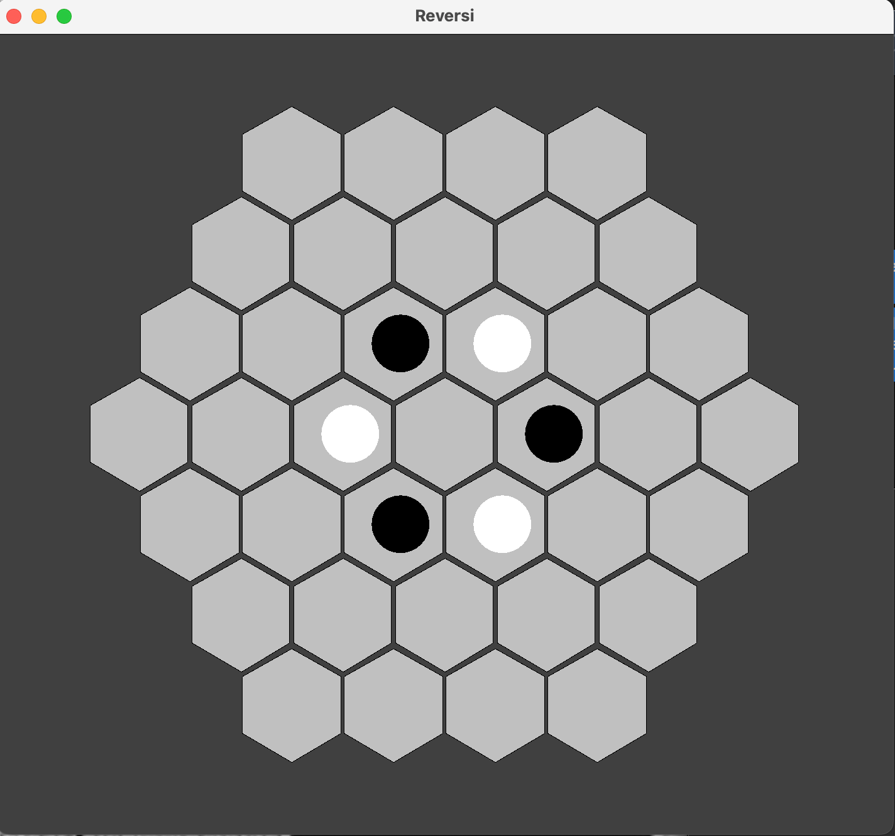
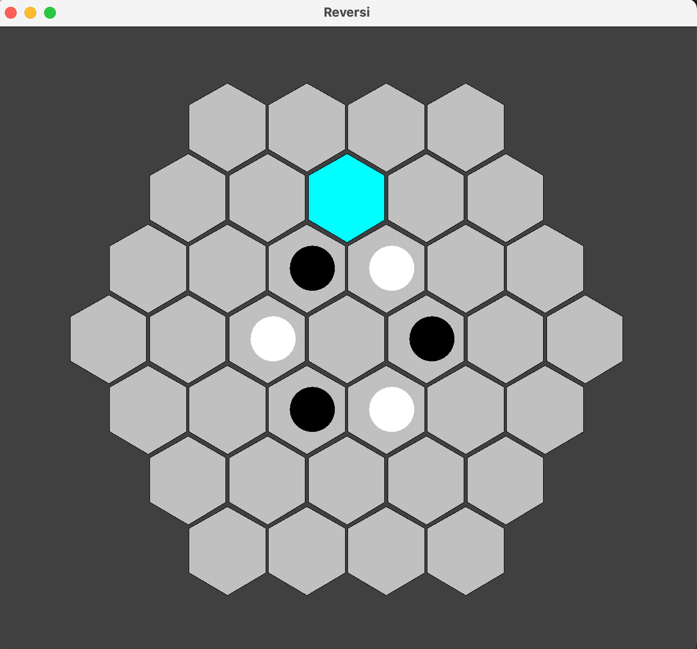
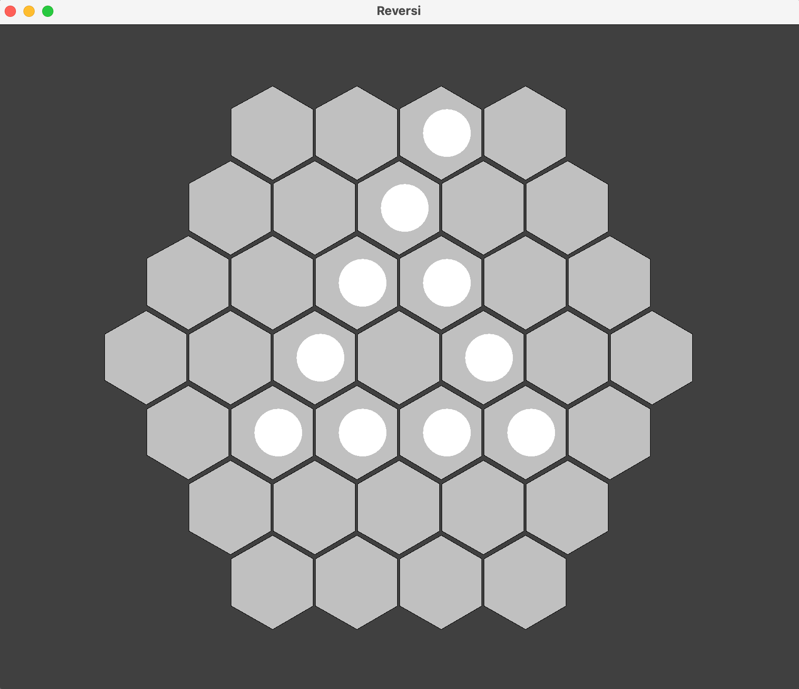

Board logicalCoordinate design is based on https://www.redblobgames.com/grids/hexagons/

    Overview: 

This code is designed to allow the user to play a game of Reversi by interacting with the
controller, which interacts with the model and textualview.
Some high level assumptions that can be
made are that the project is designed on a MVC standard and that the textualview cannot directly
change the model. Also, that only the controller is allowed
to affect things in the model. Prerequisites for using this code would be understanding all
of the player move options in the Reversi game.

    Quick start: 

A user may interact with MutableReversi through methods placeDisc() and skipTurn().
A user may interact with ReadOnlyReverseModel through methods like getColorAt(), isGameOver,
startGame(), etc.
A user may interact with the ReversiTextualView through toString() and render() methods.

    Key components: 

The model contains a list of GameCells, cells, which contains all the cells in the game. Each
cell contains a GameDisc, which can either be NEUTRAL, WHITE, or BLACK. Each GameCell contains
its own stored coordinates, in the form of Q,R,S logicalCoordinate systems. The model is driven by the
other systems through the skipCurrentTurn() and placeDisc() methods. These methods can be called
to influence what moves are made and how the board develops and looks like over time.

The textualview is also controlled by a separate system as it is given a ReadOnly model instead of a
Mutable model. The textualview does not influence anything in the model. However, it does drive other
parts of the system through the Appendable. The Appendable along with the textualview's render()
function allow other systems to effectively accept certain things in the textualview as input.

        Key subcomponents: 

-Within the model, also known as MutableReversi, the first component is size. This is the radius of
the game board from the center-most cell to the furthest most cell. This is used to calculate the
range of Q,R,S coordinates for each of the GameCells. There is also a boolean gameStared which
allows the model to check if the game has been started in each method. blacksTurn is a boolean which
calculates which players turn it is. If blacksTurn is true, then it is blacks turn. If it is false,
then it is whites turn. The final component to the model is cells, which is the list of all the
GameCells in the game. This is required for all user interaction and allows the board to have cells
with assigned discs.
Invariants in the model would be that the game cannot be played unless gameStarted is true.
Also, an invariant is that model's size will never be less than 1.

-Within the GameDisc component, there are the assigned coordinates Q,R, and S. These are all stored
as integers and can be accessed with their respective getter methods. The GameCell also has another
component, contents, which is the assigned GameDisc for that cell. Through the GameCell, the
GameDisc can be flipped between BLACK and WHITE.
Invariants in the GameDisc would be that the color will always be either WHITE, BLACK, or GREY

-Within the ReversiTextualView component, there is the ReadOnlyReversiModel. Using the model's
getColorAt() method, the textual textualview can build a rendering of the model's board. The textualview
also had an Appendable which allows it to interact with a controller. It interacts with the
Appendable through the render function.

GameDiscs can be flipped,
either to WHITE or BLACK. This happens when placeDisc is called. The placeDisc() method allows
players to interact with the board/cells by trying to flip any of the GameDiscs to either
BLACK or WHITE.

    Source organization: 

-Things associated with the controller can be found in the controller folder

-Things associated with the model can be found in the model folder. This may include interfaces
like Disc, HexagonCell, MutableReversiModel, and ReadOnlyReversiModel. All of these can allow a
reader to gain good knowledge on the functionality of the discs, cells, and models. In the model
folder, you can also find the implementations of the interfaces. The most notable of them being
the MutableReversi, which contains the methods to play the game. These would be the startGame(),
placeDisc(), and skipCurrentTurn() methods along with gameOver().

-Things associated with the textualview can be found in the textualview folder. This includes the interface for
the textualview and ReversiTextualView, which creates a basic textual textualview based on a
ReadOnlyReversiModel.

    Changes for Part 2: 
    In part one, we did not include any method to find the score of a given player because we 
    assumed the controller would handle that. We added this to the model. We also added fuctions
    to check if there are any legal moves left for the current player and if a given move is legal.
    In the previous part, we handled this in the placeDisc() method, however, the homework page
    advised we textualview this as an observation instead of an operation so we added new methods to check
    legality of moves. Some other changes we made to the project is that we added a Coordinate
    class, which allowed us to check the coordinates of each hex in a more effective matter. 
    We also added the Features interface which allows the textualview to use key actions to make moves.
    Lastly, we added one method to the model to check how many discs would be flipped given 
    a specified logicalCoordinate.

To make moves, the commands are 'p' to place a disc at the highlighted disc location and 
's' to skip turn. If the move is not legal, it will not change the rendering of the board and will
not make any moves. Currently, if a hexagon is clicked, then a System.out occurs that prints out
its logicalCoordinate locations in (Q,R,S) form. ex (0,0,0). A hexagon can be un-highlighted by clicking
on anywhere on the screen, including the same hexagon.

The Strategy that we implemented to capture the most tiles in a turn was implemented in the
CaptureMostTilesStrategy class. It is designed to go through every legal move for the given player
and return the logicalCoordinate of the title that would capture the highest number of discs in a turn.
Breaking a tie for strategy: For our strategy
, in the event of a tie, we broke this tie by choosing
the logicalCoordinate with the most negative R logicalCoordinate and Q logicalCoordinate closest to 0. This would
represent the top-left most logicalCoordinate.

Screenshots:

    Start game status:

    When Hex is selected:

    When the game is over:

    Changes for Part 3: 
    Changes that we made to the view during this part was that we cleaned up code to make it more
    readable. For example, in the player class, we changed the method playerColor() to 
    getPlayerColor(). In the previous part, we made a controller, however, it could not handle 
    strategy/AI players. In this part, we added that capability. We also added a features interface
    for the model package. This allowed for the model to tell both controllers when a move is made
    so that the views can update properly. In the assignment, it says that have "player-action" 
    listeners and "model-status" listeners. We named our interfaces accordingly. One other change
    that we made was to have startGame() and setUpGame() methods separated. Before, we had only
    a startGame() method, but now we have both so that the game can be played correctly.

    The outline of the homework says that the model should notify the players when it is its turn.
    We handle this by saying in the title of the view, the current player's turn. For example,
    the title may say "Reversi - BLACK's Turn." We also tell the players if the game is over through
    the title. For example, if the game is over, the title may say "Game Over! Winner is BLACK"

For the configuration of the game, if there are no command-line inputs, the default players go as 
follows: player1 or BLACK is a human player while player2 or WHITE is a machine player using
strategy1. The command-line allows to change the configurations of the game to make player1 machine
or player2 human, however, if invalid inputs are given to the command-line, then the configurations
will resort to the default for the invalid inputs. For example, if the args are "strategy111" and
"human", the configuration will be human and human since the second input was valid.

Changes For Part 4:
One change we made for this part of the assignment is that we ended the game if both players passed
twice each in a row. This allowed for games between AIs to end instead of skipping turn infinitely.